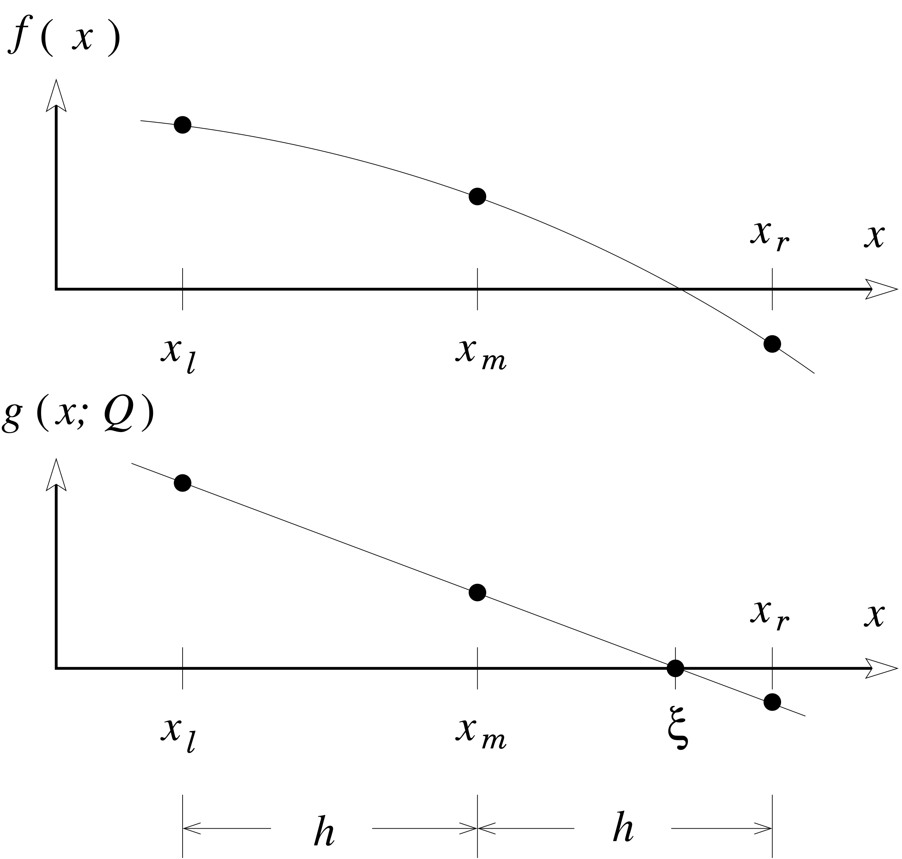

This module originated from a course in numerical methods that the author (Alan Freed) taught at Texas A&M University (TAMU).

To use this module, you will need to add the following repository to your project:

```
using Pkg
Pkg.add(url = "https://github.com/AlanFreed/Ridder.jl")
```

# Ridder

Ridder's algorithm is a root finding method similar to bisection but with quadratic convergence. For example, given a function $f(x)$, a root is sought that resides somewhere within an interval that is bounded from below (left) and from above (right) by values $x_l$ and $x_r$, with the interval midpoint being $x_m$. Ridder's method returns a value for $x$ that satisfies $f(x) = 0$.

In essence, Ridder's method transforms a nonlinear function $f(x)$ into a linear function $g(x;Q)$ where Q is a fitting parameter, as illustrated below. The zero crossing of a straight line can be found straightaway.



## The Algorithm

The premise of Ridder is to use an exponential as an approximating function. Specifically, consider the transformation
$$
g(x;Q) = f(x) \, \mathrm{e}^{(x-x_{\ell})Q}
$$
such that upon assigning a step size $h = ( x_r - x_{\ell} )  / 2$ one gets
$$
g_{\ell} = f_{\ell} \qquad
g_m = f_m \, \mathrm{e}^{hQ} \qquad
g_r = f_r \, \mathrm{e}^{2hQ} = f_r \bigl( \mathrm{e}^{hQ} \bigr)^2
$$
where we use the recursive property of the exponential, i.e., $\mathrm{e}^{ab} = \mathrm{e}^a \mathrm{e}^b$.

Because $g$ is assumed to be linear in $x$ (what $Q$ adjusts for), its value at the midpoint is $g_m = ( g_{\ell} + g_r ) / 2$, thereby allowing one to write
$$
f_m \, \mathrm{e}^{hQ} = 
      \tfrac{1}{2} \left( f_{\ell} + f_r \bigl( \mathrm{e}^{hQ} \bigr)^2 \right) 
$$

This result rearranges into a quadratic equation in $\mathrm{e}^{hQ}$
$$
f_r \bigl( \mathrm{e}^{hQ} \bigr)^2 - 2f_m \, \mathrm{e}^{hQ} + f_{\ell} = 0
$$
that when solved for $\mathrm{e}^{hQ}$ produces (recall that $f_{\ell} f_r < 0$ if a root is to reside within the interval)
$$
\mathrm{e}^{hQ} = \frac{f_m \pm \sqrt{ f_m^{\,2} - f_{\ell} f_r}}{f_r}
$$

Linear interpolation to the root $\xi$ gives
$$
\xi = x_m - g_m \frac{x_m - x_{\ell}}{g_m - g_{\ell}} = 
      x_m - f_m \, \mathrm{e}^{hQ} \frac{x_m - x_{\ell}}
      {f_m \, \mathrm{e}^{hQ} - f_{\ell}}
$$
that when combined provide an estimate for the root of
$$
\xi = x_m \pm \frac{f_m  ( x_m - x_{\ell} ) }{\sqrt{f_m^{\,2} - f_{\ell} f_r }} 
\quad where \quad 
\pm = \begin{cases} 
         + & \text{if } f_{\ell} - f_r > 0 \\
         - & \text{if } f_{\ell} - f_r < 0
      \end{cases}
$$
which is Ridder's formula for approximating a root.

## Function

```julia
root = findRoot(xleft::Float64, xright::Float64, f::Function, 
                tol::Float64=1.0E-9)::Float64
```
where

    `xleft`  brackets the root to its left,
    `xright` brackets the root to its right,
    `f`      is some function `f(x)` that returns a real value, and
    `tol`    is the error tolerance sought, defaulting to 10⁻⁹.

which has the same interface that one would use for finding a root via bisection, which is a method with linear convergence. (Ridder's method has quadratic convergence.)

## Version History

### Version 0.1.0

The original version, dated 25 October 2024. It is a port from the author's python code from a class that he taught in numerical methods to mechanical engineers when he was a professor at Texas A&M University.
